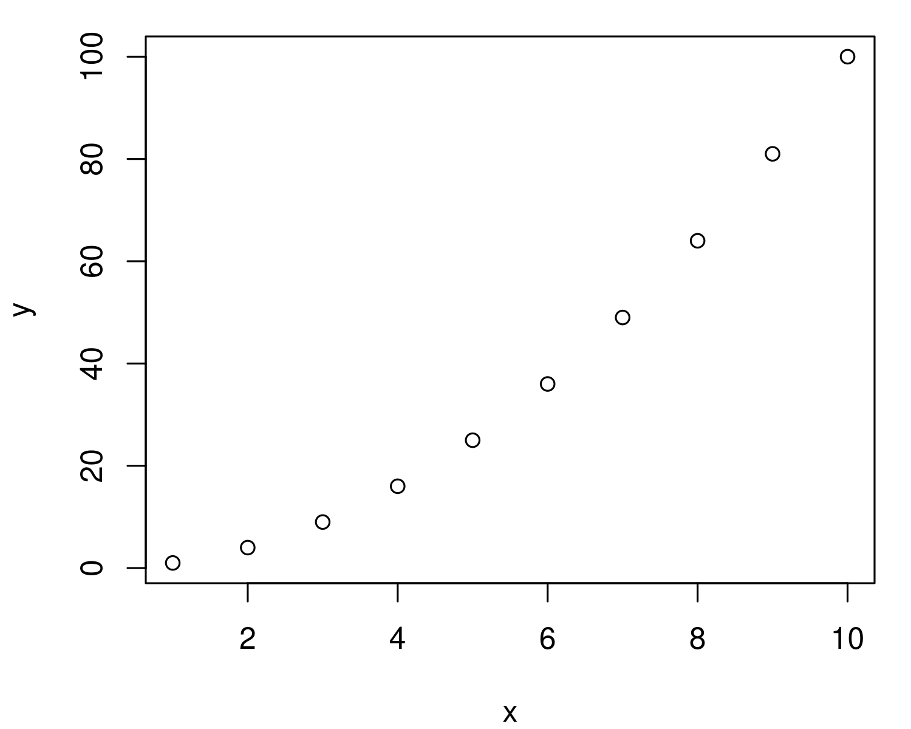
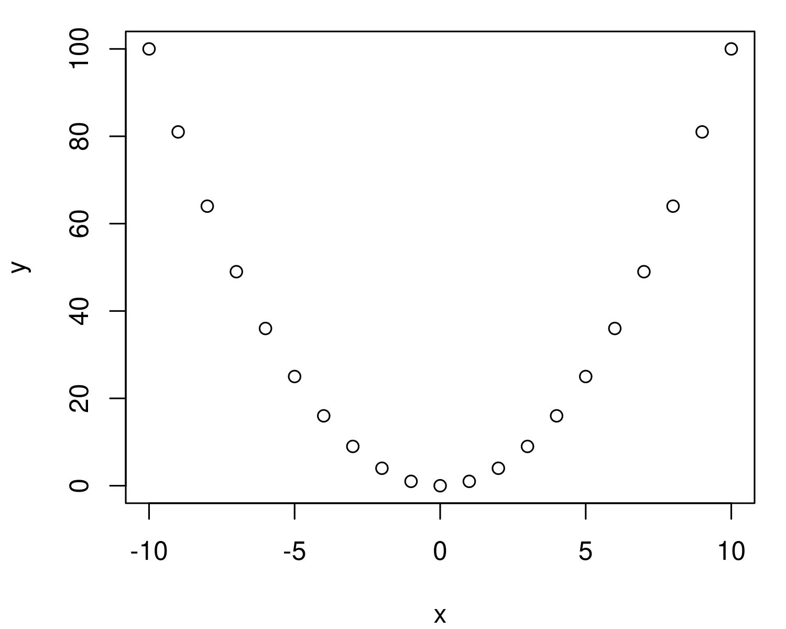
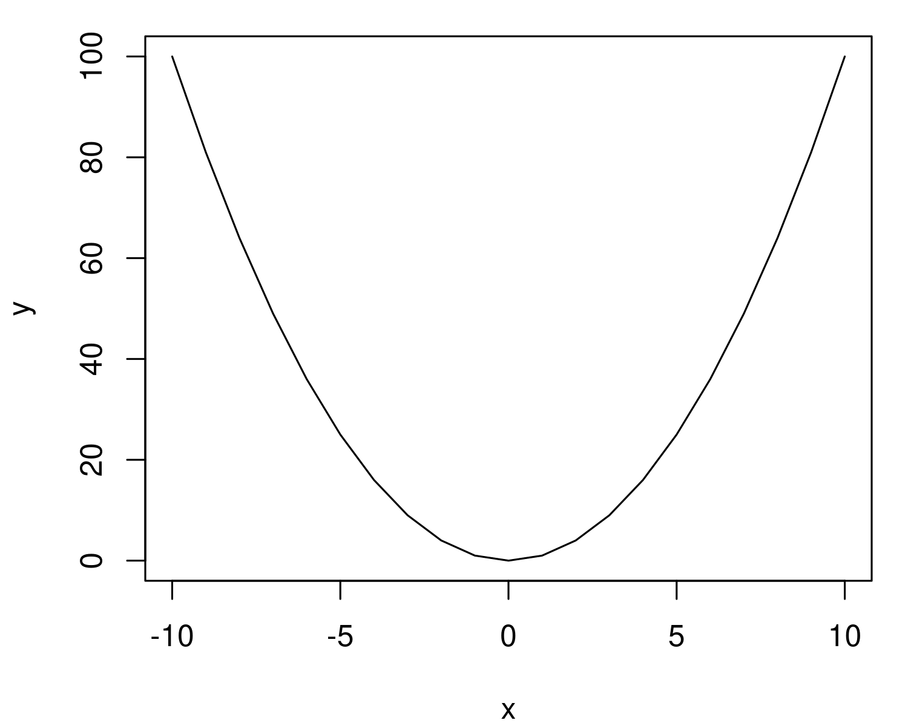

+++
author = "Blair Fix"
title =  "8. Using R as a graphing calculator"
date = "2022-07-24"
slug = "r-graphing-calculator"
description = "Here's how to use R's vector operations to plot simple functions."
tags = [ "R", "graphing calculator", "vectors", "plotting", "variables" ]
[twitterCard]
    image = "2022/07/r-graphing-calculator/plots/plot3.png"
+++


In my [first R tutorial](https://sciencedesk.economicsfromthetopdown.com/), I showed you how to use R as a simple calculator. Now let's step things up by using R as a graphing calculator. I assume here that you know how to open the R console. If you don't know how to do that, see the first tutorial.


### Plotting a parabola

The way I learn to program is by first having something I want to do, and then by figuring out how to do it. So let's start with what we want to achieve. We want to plot a simple parabola, defined by the equation y = x.

How do we do that? 


### Variables

Our first step will be to see how variables work in R. In the equation for our parabola, we have two variables: x and y.

In R, you can define a variable just like you would in algebra. To define a variable called *x* that is equal to 5, I type `x = 5` and press enter:

```R
x = 5
```

If all goes well, nothing will happen. That's right, R does not tell you when it has successfully stored a variable. (Side note: this is one reason many people use R with an IDE (integrated development environment) like [Rstudio](https://www.rstudio.com/). The IDE will show you the variables you have stored.)

To check our variable, we can type `x` into the console and press enter. We get back the value we defined:

```R
> x
[1] 5
```

Another note. In addition to using the `=` sign to define values, in R you can also use the `<-` symbol, which is supposed to represent an arrow going into the variable:

```R
x <- 5
```

I'm going to be honest; I *never* use this notation. I find it ugly, and it's not how other computer languages work. And so I always define variables using the `=` sign. 

Back to our parabola, which is defined by the equation y = x.

In R, we've already defined `x`. So let's now define `y`. Type the following into your console and press enter:

```R
y = x^2
```

Again, if all goes well, R will remain silent. We can check that our y-value is stored correctly by typing `y` and pressing enter:

```R
> y
[1] 25
```

Remember that we defined `x = 5`. So it seems that `y` has the correct value, since  5 = 25.

What we've got right now is a single point on the x-y coordinate plane; the point (x = 5, y = 25). To make our parabola, we need many more points. But how do we do that?


### Vectors

Here's where 'vectors' come in. In R, a 'vector' is just a variable that holds multiple values. In other languages, this type of object is called an 'array' or a 'list'. But remember that R thinks like a mathematician. And to mathematicians, a list of values is called a 'vector'.

Here's how it works. Suppose I want to list all the numbers between 1 and 10. R has a nice notation for achieving this. We use the `:` symbol. To list the numbers from 1 to 10, we type `1:10` and press enter:

```R
> 1:10
 [1]  1  2  3  4  5  6  7  8  9 10
```

R automatically prints all the integers between 1 and 10. Nice!

I suggest playing around with this feature to get a sense for how it works. For example, you don't have to start at the number 1. You can start at 5:


```R
> 5:10
[1]  5  6  7  8  9 10
```

And you can go higher (or lower) than 10. Here's up to 20:

```R
> 5:20
 [1]  5  6  7  8  9 10 11 12 13 14 15 16 17 18 19 20
```

Once you're comfy with this notation, realize that you can use it to define a variable. For example, we can dump the numbers from 1 to 10 into the variable `x`:

```R
x = 1:10
```

Again, if all goes well, R will remain silent. But you can check your variable by typing it into the console:

```R
> x
 [1]  1  2  3  4  5  6  7  8  9 10
```

We're getting closer to our parabola! Now let's define the variable `y` as the square of `x`:

```R
y = x^2
```

Here's what R has stored for `y`:

```R
> y
 [1]   1   4   9  16  25  36  49  64  81 100
```

Everything looks good.


### The plot function

So far we've got a list of values for `x` and `y`. To get a parabola, we need to plot these values on the x-y coordinate plane. We do that using the `plot` function. This function takes x and y values, and plots them on a coordinate plane:

```R
plot( x, y )
```

Here's what I get back:



Alright, we're getting close to our parabola. We just need to pick better values for `x`.

Let's define `x` to go from -10 to 10:

```R
x = -10:10
```

Now let's use these values to define `y`:

```R
y = x^2
```

And finally, plot the values:

```R
plot(x, y)
```

Presto! We've got a parabola:




By default, R's plot function will plot points. But our parabola will look prettier if we use a line. We can do that by telling the plot function to use `type = "l"`:


```R
plot( x, y, type = "l")
```

And now we get a very pretty parabola:



If you've gotten this far, try plotting a slightly different function. 

For example, y = 2 x. 

First, define the range for your variable `x`. The define `y` as:

```R
y = 2*x^2
```

Or how about y = x - 2:

```R
y = x^2 - 2
```

Remember that the best way to learn R is to experiment. Happy plotting!

