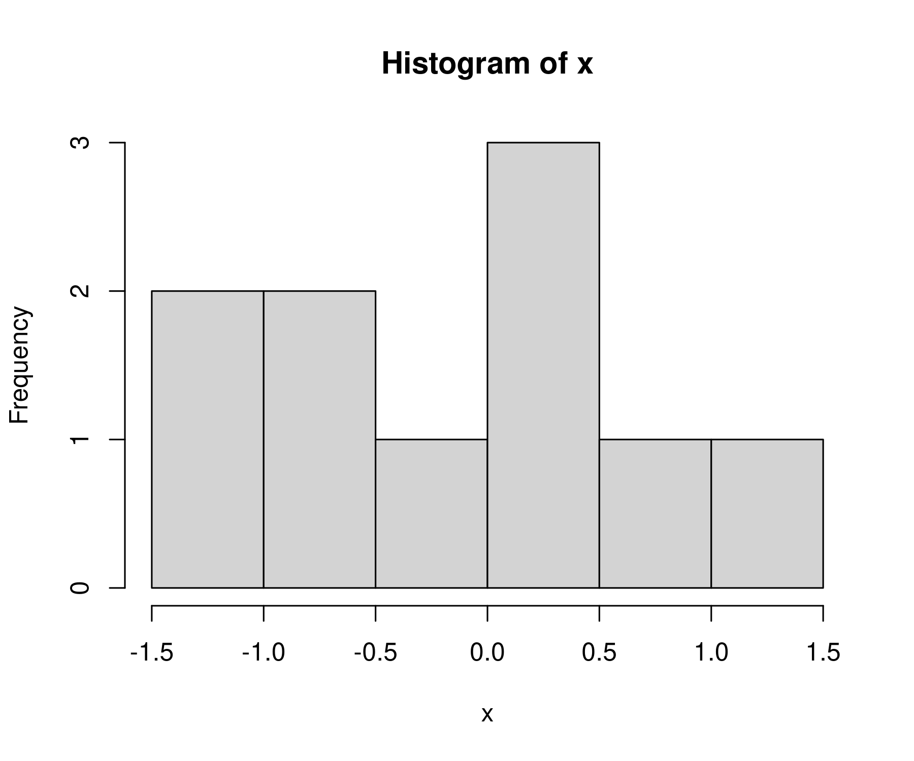
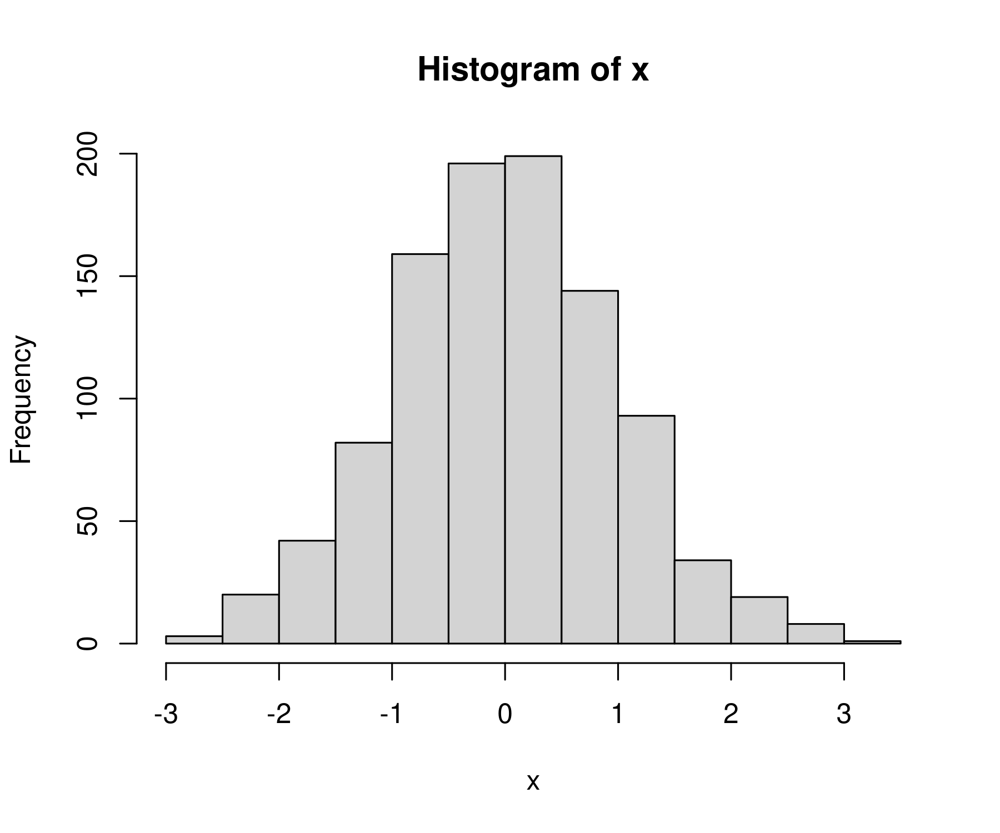
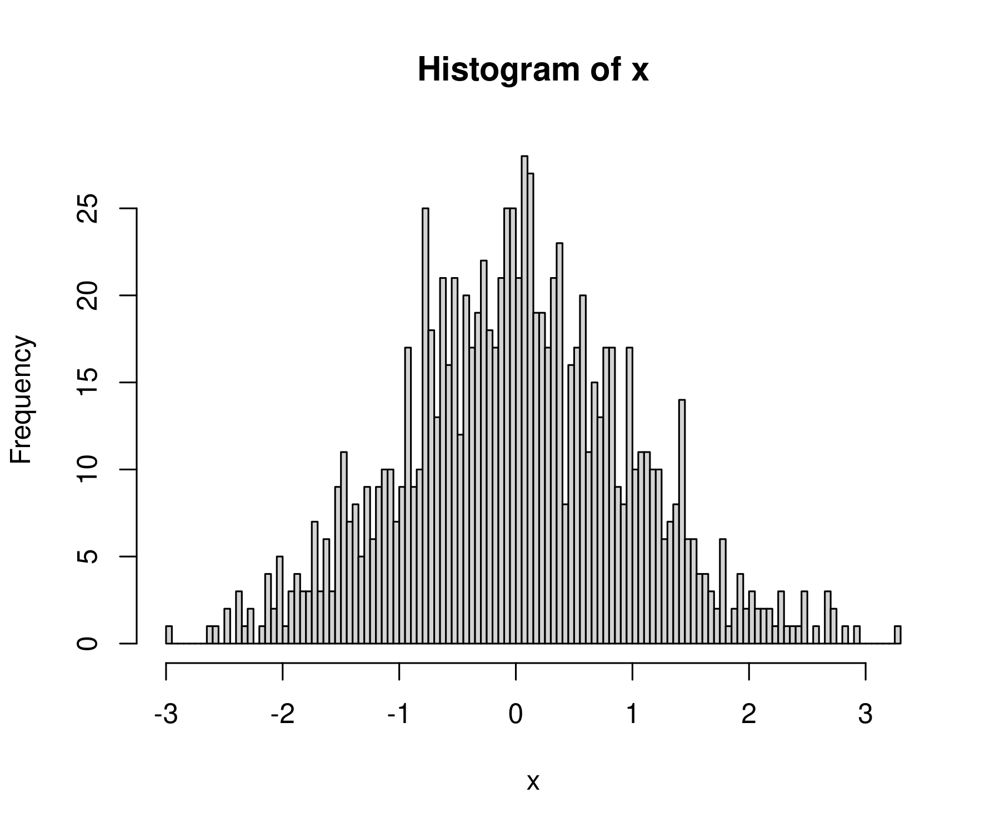
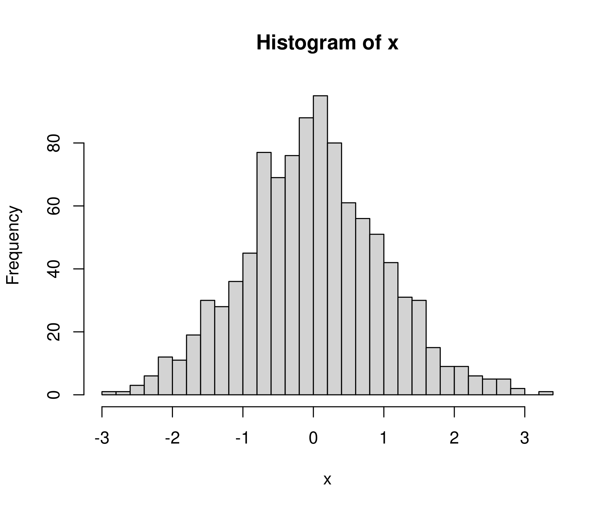
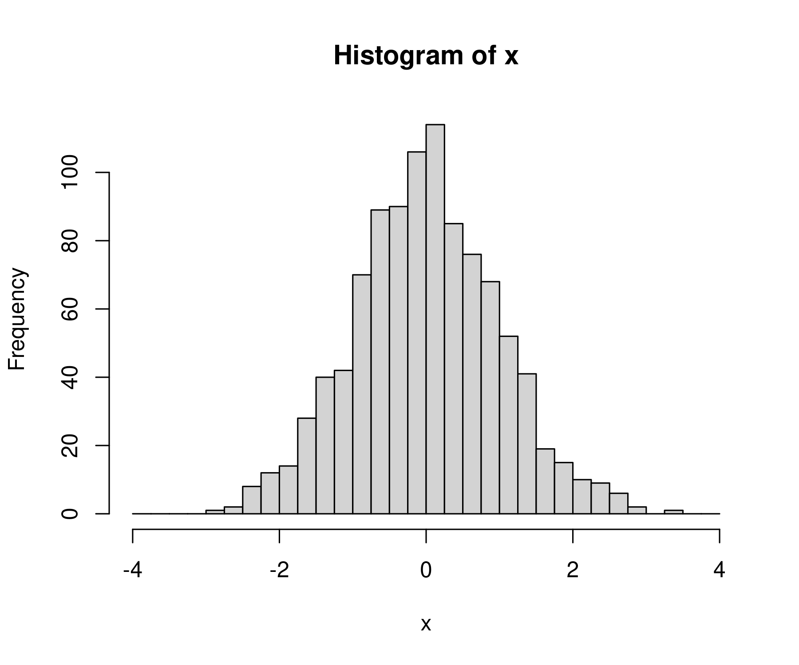
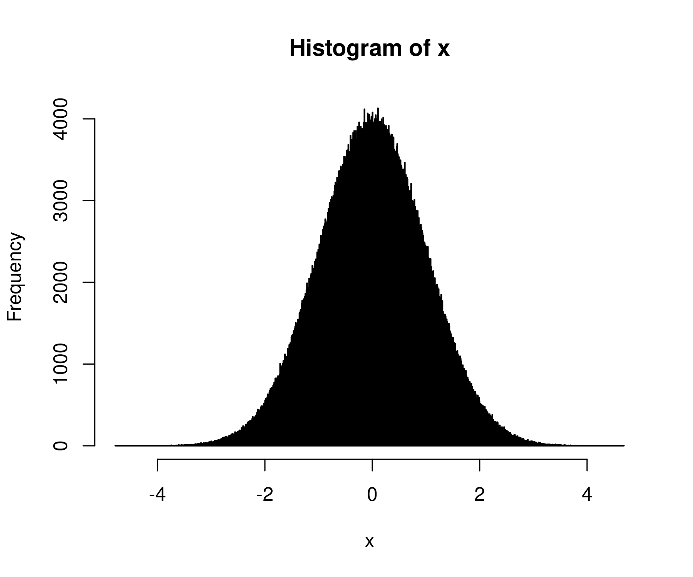

+++
author = "Blair Fix"
title =  "16. Histograms in R"
date = "2022-10-19"
slug = "r-histogram"
description = "Here's how to use histograms to get a sense for your data."
tags = [ "histogram", "R", "normal distribution", "random numbers", "hist", "rnorm"]
+++

If I had to vote on the number one feature missing from Excel, it would be *histograms*. Histograms provide a convenient way to get a sense for your data. Yes, if you're clever, you can get Excel to make them. But there's no out-of-the-box function. 

In R, things are different. R has a function called `hist` that  makes histograms. Here's how to use it.


### First, some random numbers

Before we get to our histogram, we need to briefly review how to generate random numbers. Often, when we're dealing with data in an abstract sense (i.e. not a particular dataset) its convenient to work with randomly generated numbers  rather than real data.

R has a variety of tools for making random numbers. Today, we'll use the `rnorm` function, which generates random numbers that follow a normal distribution (i.e. a bell curve).

The `rnorm` function takes 3 inputs:

* `n`: how many random numbers you want
* `mean`: the mean of your normal distribution
* `sd`: the standard deviation of your normal distribution

Here's an example. Let's generate 10 random numbers from a normal distribution with a mean of 0 and a standard deviation of 1.

```R
x = rnorm(n = 10, mean = 0, sd = 1)
```

Here's what we I get:

```R
> x
 [1]  1.00764212 -1.22787025 -0.74604562  0.27375860 -1.49136648  0.50941624
 [7]  0.41279789 -0.59357606 -0.07555823  0.11314650
 ```

Because we're dealing with random numbers, you'll get different numbers than me. However, when we look at how these numbers are distributed, we should see the same pattern.

### The histogram function

In R, you can make a histogram with one command. Take a vector of numbers (here `x`) and throw it into the `hist` command:

```R
hist(x)
```

Using the 10 random numbers from above, here's what I get:



It's not much of a bell curve, is it. That's because we're working with 10 numbers. Let's increase our sample of random numbers to `n = 1000`.

```R
x = rnorm(n = 1000, mean = 0, sd = 1)

hist(x)
```

Now we get something that better resembles a bell curve




### What am I looking at?

Let's back up and describe what we're looking at when we stare at R's default histogram.

On the horizontal axis, R plots the values of our variable. Here, that's `x`. 

The purpose of a histogram is to put these values into various 'bins', and then see how many values fall within each bin (what R calls 'frequency'). So the bars correspond to the various bins. And the height of each bar tells us how many values of `x` fall within each bin. 

Because we're working with a normal distribution. We expect to get a histogram that looks like a bell curve. And we do!


### Changing the number of bins

By default, R will guess how many bins to use for the histogram. If you don't like the default, you can change it using the `breaks` value.

Let's make a histogram with 100 breaks.

```R
hist(x, breaks = 100)
```

Now we get a lot more bins in the data:



That's a bit too many breaks. Let's try 40:

```R
hist(x, breaks = 40)
```

This looks a bit better:




### Manual breaks

Instead of telling R how many bins we want, we can specify the exact locations where the bins should break. To do that, let's first review the sequence function. The function `seq` creates a sequence of numbers that have a defined step size. It takes 3 inputs:

* `from`: value where the sequence should start
* `to`: value where the sequence should end
* `by`: the step value of the sequence

For example, here's how to create a  sequence of numbers from 0 to 4 that increase by 0.5 between elements:

```R
seq(from = 0, to = 4, by = 0.5)
```

Here's the sequence:

```R
[1] 0.0 0.5 1.0 1.5 2.0 2.5 3.0 3.5 4.0
```

We can use the sequence function to define the breaks for our histogram. First define the bin breaks. Let's make a sequence from -4 to +4 with a step interval of 0.25:


```R
bins = seq( from = -4, to = 4, by = 0.25)
```

Then  tell R to use these values as the breaks (edge) of each histogram bin. Here's what we get:

```R
hist(x, breaks = bins)
```



Note: if you specify manual breaks, they must cover the entire range of your data. If they don't R will throw an error.

For example, let's make bins that go from 0 to 2.

```R
bins = seq(from = 0, to = 2, by = 0.5)
```

Since our values of `x` extend beyond this range, R will not like these breaks:

```R
> hist(x, breaks = bins)

Error in hist.default(x, breaks = bins) :
  some 'x' not counted; maybe 'breaks' do not span range of 'x'
```

### `hist` is blazing fast

In R, the `hist` function is both easy to use and extremely powerful. It can handle millions of data points with ease:

To see this fact, let's generate 1 million random numbers:

```R
x = rnorm(n = 1e6, mean = 0, sd = 1)
```

(Here, `1e6`  is 1 million in scientific notation.)

Now let's take these million numbers and plot their histogram. For fun, let's use 1000 bins:

```R
hist(x, breaks = 1000)
```

I get back a beautiful bell curve:




### Store your histogram values

By default, the `hist` function plots your histogram. Perhaps, though, you just want the underlying data. You can get that by dumping the histogram function into a variable: 

```R
hist_data = hist(x, plot = F)
```

The `plot = F` tells R not to plot the histogram. If you want to both plot the histogram and store the values, remove this code.


The `hist` function will dump out a bunch of values, including the bin breaks, the counts in each bin, the midpoints of each bin, and the 'density' values (more on what this means in the future). The data will be formatted as a list, which is not the most convenient data type. Still, you can get the data you want using the `$` command.

For example, to get the counts in each bin, I'd enter:

```R
hist_data$counts
```

Here's what I get:

```R
 [1]     30    221   1139   4866  16733  43714  91901 149683 191697 191026
[11] 150284  91876  43903  16614   4966   1135    187     21      4
```

### Use `hist` to explore your data

I mostly use the `hist` function to get a sense for my data. If I want to make a publication-ready histogram, I use ggplot. But that's a topic for the future.

For now, enjoy the fact that R makes histograms easy.


