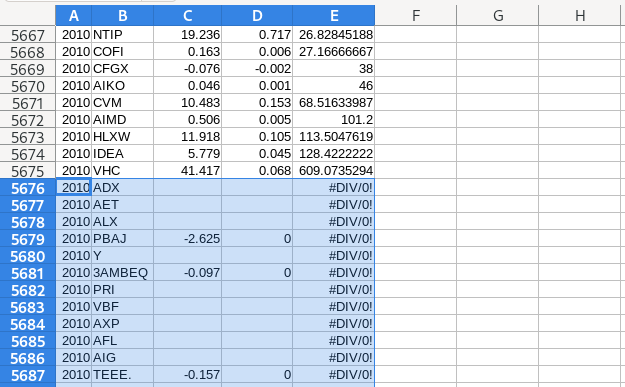

+++
author = "Blair Fix"
title =  "20. An R lesson for Excel users"
date = "2022-12-17"
slug = "R-for-excel-users"
description = "Here's how to do some common spreadsheet tasks in R"
tags = [ "spreadsheet", "R", "data frame", "order", "is.finite", "Excel" ]
+++

Are you an Excel user who wants to get a taste of R? Well, this lesson is for you. In what follows, I'll do some simple data manipulation in Excel. Then I'll show you how to do the same thing in R.


### Financial data

First off, let's download some financial data from [this link](https://sciencedesk.economicsfromthetopdown.com/2022/11/r-access-elements/data/fdata.csv).

After the download, you'll have a file called `fdata.csv`. Open it in your choice of spreadsheet program. I'll use [LibreOffice Calc](https://www.libreoffice.org/discover/calc/).

Inside the file, you should see the following data:


What are we looking at? As you can probably guess, this is financial data from US firms, organized by year and by the stock market ticker of the company.


### Get the same data in R

In Excel, you import data by clicking a file and opening it with your spreadsheet program. With R, there's no clicking. Instead, you write code that tells R to get the data.

Conveniently, we can import data directly from a url. Here's the code, which uses the `read.csv` function to import data from our url and dump it into a variable called `fdata`.

```R
url = "https://sciencedesk.economicsfromthetopdown.com/2022/11/r-access-elements/data/fdata.csv"

fdata = read.csv(url)
```

### Calculate the markup in Excel

As a simple task, let's use our financial data to calculate the markup of each company. The markup, if you're not familiar, is profit as a share of sales

To calculate the markup in Excel, we'd first define a new column called 'markup'. Then we'd go to the first cell and apply the appropriate formula (profit / sales). For our first company, dividing profit by sales corresponds to dividing cell C2 by cell D2.


When I press enter, Excel gives me the result below:


So the markup of our first company, AIR, is 0.039 --- or about 4%.

Of course, we don't want the markup for just one company. We want the markup for *all* the companies in our database. To do that in Excel, we copy our formula from cell E2 down to all of the cells in column E (with corresponding data in columns C and D).

The results look like this:


### Calculating the markup in R

Now let's use R to calculate the markup. To start, note that there is a big conceptual difference between Excel and R. In Excel, we manipulate cells. In R we manipulate *variables*.

From the code above, we've read our financial data into a variable called `fdata`. R won't tell you what's inside `fdata` unless you ask it to. 

To peer inside `fdata`, let's use the `head` function. It will dump out the first 6 rows of data:


```R
> head(fdata)
  year ticker   profit     sales
1 2010    AIR   69.826  1775.782
2 2010 ADCT.1   62.000  1156.600
3 2010    AAL -471.000 22170.000
4 2010   CECE    2.105   140.602
5 2010    AVX  244.003  1653.176
6 2010    PNW  350.053  3263.645
```

So the R data is conceptually equivalent to our spreadsheet --- it's stored in rows and columns. Except now there's nothing to click on. Instead, we do everything with code.

At first, this code-based workflow may seem daunting. But after you get used to it, you'll find that it's actually easier than using Excel.

For example, calculating the markup of every company in our database takes one line of code:

```R
markup = fdata$profit / fdata$sales
```

To understand this code, let's back up a bit. In R, we access columns of a database using the `$` operator. So the code `fdata$profit` accesses all of the data in the `profit` column of `fdata`. And the code `fdata$sales` accesses all of the data in the `sales` column.

So to calculate the markup, we just divide the two columns.

Now as it stands, the variable `markup` is a stand alone variable that's not connected to fdata. But that's easy to change. To calculate the markup and put it in a new column of `fdata`, we can again use the `$` symbol:


```R
fdata$markup = fdata$profit / fdata$sales
```

And with that, we've calculated the markup for every company in our database. Let's have a look at the first six entries:


```R
> head(fdata)
  year ticker   profit     sales      markup
1 2010    AIR   69.826  1775.782  0.03932127
2 2010 ADCT.1   62.000  1156.600  0.05360540
3 2010    AAL -471.000 22170.000 -0.02124493
4 2010   CECE    2.105   140.602  0.01497134
5 2010    AVX  244.003  1653.176  0.14759651
6 2010    PNW  350.053  3263.645  0.10725830
```

### R is scale invariant

While initially a bit more abstract than using Excel, the nice thing about R is that your code is scale invariant. What do I mean? Well, the code above will calculate the markup of every company in `fdata`, regardless of whether our database contains 10 entries or 10 million entries.

The same is not true with Excel. Have you ever tried using Excel to manipulate 10 million lines of data? It's not fun ... at all. The reason it is not fun is that Excel mixes the act of *showing* you the data with the act of data *analysis*. That gives you a 'feel' for the data, but it makes things scale poorly. 

In R, the two tasks are separate. R won't show you the data unless you ask. And with a huge database, you'll *never* ask to see the whole thing. So the analysis stays snappy, even with big datasets.


### Sort by markup in excel

Next, let's do another common task. Let's sort our data by a specific column. Since we just calculated the markup, let's sort by the markup.

To do that, we select all the columns of our data. Then in my spreadsheet program (LibreOffice), I go to the 'Data' menu and select 'Sort'. That gives me the following menu. I tell the program that I want to sort by 'markup' in ascending order.


The results look like this:


### Sort by markup in R

Now let's use R to sort our data by markup. As a reminder, we first have to calculate the markup with the code below:


```R
fdata$markup = fdata$profit / fdata$sales
```

To sort `fdata` by markup, we write the following:


```R
fdata[ order( fdata$markup ), ]
```

There are several things going on with this code, so let's break it down. Looking at the inner part of the code, we see the `order` function. This takes in data and spits out the indexes for the ordered values.

We can use the `order` function on its own like this:

```R
order( fdata$markup )
```

It will return a vector containing the sorted indexes of `fdata$markup`.

```R
> order(fdata$markup)
   [1]   34   43   66  187  257  292  480  639  649  651  703  800 1046 1073
```

To sort `fdata` by these indexes, we pass them to our database using the bracket operators `[]`, which accesses columns and rows of our data, like this:


```R
fdata[ columns, rows ]
```

In our sorting example, we want all of the rows of `fdata`. The way we do that is by leaving the rows entry blank

```R
fdata[ columns, ]
```

Let's put it all together. The columns that we want are the ordered indexes of the markup, `order(fdata$markup)`. We substitute that in the columns spot to give

```R
fdata[ order(fdata$markup), ]
```

As is, this code will dump the sorted values of `fdata` onto the screen. If we want to store these values, we have to put them into a new variable. Let's dump them in a variable called `fdata_sort`:


```R
fdata_sort = fdata[ order(fdata$markup), ]
```

Let's see what's inside:

```R
> head(fdata_sort)
    year ticker  profit sales markup
34  2010   PBAJ  -2.625     0   -Inf
43  2010 3AMBEQ  -0.097     0   -Inf
66  2010  TEEE.  -0.157     0   -Inf
187 2010   MSGI -13.372     0   -Inf
257 2010   CLSN -18.818     0   -Inf
292 2010   CDCO  -3.278     0   -Inf
```

Interesting. That's different than our Excel results. Why?

Well, it turns out that when you divide by zero, R and Excel treat the results differently.

In our financial data, we've got a bunch of firms with 0 sales, which we then divide by to calculate the markup. When you divide by 0 in Excel, the result is a non-number, '\#DIV/0!'.

In R, however, dividing by 0 returns either `Inf` or `-Inf`, which stands for positive/negative infinity. These infinite values count when we sort our data. That's why we see infinities at the top of our data.


### Remove infinities in Excel

Since they aren't useful values, let's go ahead and remove the divide-by-zero values in Excel. The easiest way to do that is to simply find these entries and delete them manually.




Right away, this gives me a unsettling feeling, because I'm deleting part of my original dataset. If I was smart, I made a backup. But still, this cuts to a basic weakness with Excel. Often, you end up manipulating and changing your source data. If you make a mistake, the risk is that you'll ruin your dataset, and have to start again from scratch


### Remove infinities in R

In R, things work differently. We never touch the source data. Instead, we manipulate copies of this data, ensuring that the raw data never changes.

To remove infinite values, R has a nifty function called `is.finite`. It returns TRUE/FALSE values indicating if the corresponding elements are finite.

To practice using `is.finite`, let's make a test vector, `x`:

```R
x = c(-Inf, 10, Inf)
```

Now let's put `x` into `is.finite`:

```R
> is.finite(x)
[1] FALSE  TRUE FALSE
```

As expected, only the second element is finite.


Now, what's important is that we can pass the results of `is.finite` back to our dataset. The syntax is the same as when we passed the results of `order` back to `fdata`.

This time, though, we're working with our sorted data, which we called `fdata_sort`. To access columns and rows, we use the bracket syntax:

```R
fdata_sort[ column, row]
```

We want all of the rows, so we leave that blank.

```R
fdata_sort[ column, ]
```

Which columns do we want? The ones where `fdata_sort$markup` is finite:

```R
fdata_sort[ is.finite( fdata_sort$markup), ]
```

Let's store these results in a variable called `fdata_finite`:

```R
fdata_finite = fdata_sort[ is.finite( fdata_sort$markup), ]
```

The results look like this:

```R
> head(fdata_finite)
     year ticker   profit sales     markup
5403 2010   NWBO  -27.368 0.010 -2736.8000
3217 2010   KIWB   -3.972 0.002 -1986.0000
6030 2010   MNKD -170.560 0.093 -1833.9785
4982 2010   VGLS   -7.240 0.006 -1206.6667
2343 2010   CASC  -15.618 0.018  -867.6667
3694 2010   CDJM   -0.811 0.001  -811.0000
```

Nice! No more infinities.


### Using an R script

The nice thing about Excel is that it gives you a visual sense for how you've manipulated your data. The downside, is that it's hard to keep track of what you've done, especially when the analysis gets complicated.

In R, it's harder to visualize how you've manipulating the data. But the upside is that once you understand R code, your scripts will document your analysis. 

Here, for example, are all of the steps to read the financial data, calculate the markup, sort by markup, and remove infinite values:


```R
# get financial data
url = "https://sciencedesk.economicsfromthetopdown.com/2022/11/r-access-elements/data/fdata.csv"
fdata = read.csv(url)

# calculate the markup
fdata$markup = fdata$profit / fdata$sales

# sort by increasing markup
fdata_sort = fdata[ order(fdata$markup), ]

# remove infinite values
fdata_finite = fdata_sort[ is.finite( fdata_sort$markup), ]
```

Notice that I've commented as I go (indicated by the lines starting with `#`). When R runs the code, it will ignore these lines. Their function is to give *you*, the programmer, documentation about what you've done.

The nice thing about this workflow is that it is easy to change. Suppose that I want to add a step between sorting by the markup and removing infinite values. In Excel, I'd have to redo the analysis, because removing data literally deletes it from the database. 

But in R, things are much easier. I just add a new line of code where I want the new analysis to go. Then I rerun the script, and get what I want. This is the beauty of doing things with code. The workflow is self documenting, easy to change, and easy to rerun.

Happy R coding!
