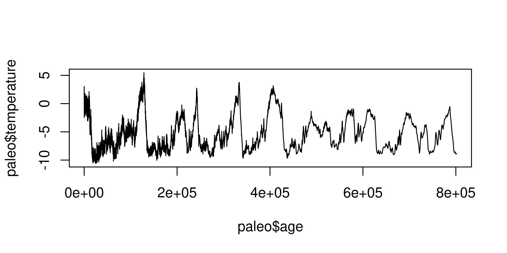
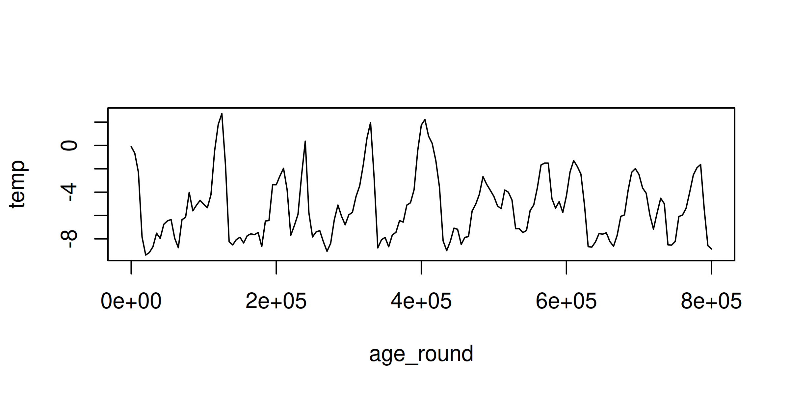

+++
author = "Blair Fix"
title =  "22. Using data.table to get grouped stats in R"
date = "2023-03-24"
slug = "data-table-aggregate"
description = "I teach you how to use the data.table package to get stats on groups of data."
tags = [ "data.table", "aggregate statistics", "paleoclimate", "group statistics"   ]
+++


Today we'll learn about the data.table package. It's my daily driver for doing summary statistics on groups of data. Here's how it works.


### data.table basics

Let's start by installing and loading the `data.table` package:

```R
# install the data.table package
install.packages("data.table")

# load the data.table package
library(data.table)
```

Now to some basic functions. The data.table package provides blazing fast functions for reading and writing data. To read in data, use `fread`:


```R
# read in data
d = fread('my_data.csv')
```

To export data, use the `fwrite` function:

```R
# write data
fwrite(d, "some_data.csv")
```

### What's a data.table?

When you import data using `fread`, it will be formatted as a data.table. So what's that? Well, it's a lot like an R data.frame, but with a bunch more features.

Here's a quick review of the basics. Let's create a simple data.table. First, we'll make two vectors, `x` and `y`:

```R
x = c(1, 1, 3)
y = c(4, 5, 6)
```

Then we'll bind them into a data.table using the `data.table` command:

```R
z = data.table(x, y)
```

Here's what `z` contains:

```R
> z
   x y
1: 1 4
2: 1 5
3: 3 6
```


### Access elements

Like a data.frame, we can axis elements of a data.table using the bracket operator, as follows:

```R
z[ row, column ]
```

Here's data from the first row and second column:

```R
> z[1, 2]

   y
1: 4
```

Also like a data.frame, if we leave the row entry blank, we'll get back the whole column:

```R
> z[, 2]

   y
1: 4
2: 5
3: 6
```

### The `by` operator

Now to the magic. With data.table, we get something call the `by` operator. It allows us to apply functions to groups of data. 

Conceptually, the syntax looks like this

```R
z[ , function, by ]
```

First, we've got a blank row index, which signifies that we want to use every row of the dataset. Then we've got some `function` that we want to apply based on the `by` criteria.

Here's a simple example applied to our `z` data.  Suppose that we want to get the mean value of `y` for every unique value of `x`. Here's the syntax:

```R
z[ , mean(y), by = x ]
```

And here's the result:

```R
   x  V1
1: 1 4.5
2: 3 6.0
```

To make sense of what happened, it helps to refer back to our original data.table `z`:

```R
> z
   x y
1: 1 4
2: 1 5
3: 3 6
```

So our command found the average value of `y` for each unique value of `x`. Operatively, that means it averaged the values `y = 4` and `y = 5`, and retained the value `y = 6`.


### Naming the output

Notice that by default, R named our statistic `V1`. That's not very descriptive.

```R
   x  V1
1: 1 4.5
2: 3 6.0
```

If we want a better name, we have to put our function inside the syntax `.( )`. For example, let's call the output statistic `y_mean`:


```R
z[ , .( y_mean = mean(y) ), by = x ]
```

The result:

```R
   x y_mean
1: 1    4.5
2: 3    6.0
```

Notice that the data.table syntax can get a bit unwieldy if you put it all on one line. For that reason, I prefer to split it up as follows:

```R
z[,
  function,
  by
 ]
```

Back to our example, the cleaner formatting looks like this:


```R
z[,
  .( y_mean = mean(y) ), 
  by = x 
  ] 
```

Nothing's change here with the syntax. But I've broken the code across several lines to help keep track of what I'm doing. 


### Some real data

Enough with the toy examples. Let's play with some actual data. Today, we'll work with paleoclimate data --- the deep history of Earth's temperature. (The data is from [this paper](https://epic.awi.de/id/eprint/16356/1/Fis2007b.pdf).)

Let's `fread` the data from the following url:

```R
url = "https://sciencedesk.economicsfromthetopdown.com/2023/03/data-table-aggregate/temp/temp.csv"

paleo = fread(url)
```

Next, let's see what we've got:

```R
> paleo

               age temperature
   1:     38.37379        0.88
   2:     46.81203        1.84
   3:     55.05624        3.04
   4:     64.41511        0.35
   5:     73.15077       -0.42
  ---
5781: 797408.00000       -8.73
5782: 798443.00000       -8.54
5783: 799501.00000       -8.88
5784: 800589.00000       -8.92
5785: 801662.00000       -8.82
```

Alright, we have a dataset with two columns. The `age` column contains time data, measured in years before 1950. The `temperature` column contains temperature data. (It's measure in terms of the temperature difference between the date in question and the average temperature over the last 1000 years.)

To get a better sense for this paleo temperature data, let's plot it using a line chart:

```R
plot( paleo, type ="l" )
```

Here's the result:




OK, it's not a chart I'd publish. But it gives a rough sense for the data. As we move right on the horizontal axis, we move back in time.  (The unit `e+05` is how R says 100K years.) On the vertical axis, we see the fluctuations on the Earth's temperature (in degrees Celsius). Behold the ice age cycles!

Looking at the chart, you can see that there's a lot of noise in the data, especially as we get closer to the present (left side). A simple way to clean the data is to average the temperature across larger units of time. Let's do that with data.table.


### Average temperature by group of time

The first thing we'll do is create groups of `age` data, rounded to the desired level of accuracy. Let's start with some prerequisite math. If you want to round data to a given level of accuracy, the following code is useful:

```R
floor( x / accuracy ) * accuracy
```

Here's how it works. The `floor` function rounds data down to the nearest integer.  When we divide and then multiply by the `accuracy` parameter,
we dictate the level of precision in our rounded data. For example, to round the number 85 to the nearest 10, we'd set `accuracy = 10`.

```R
accuracy = 10
x = 85

> floor( x / accuracy ) * accuracy
[1] 80

```

As expected, we get back 80. To get a sense for how the code works, try different values of `x` and different levels of `accuracy`.

Back to our paleo temperature data. Let's create a new column called `age_round`. In it, we'll round the age data to the nearest 5000 years:

```R
# round age data to 5000 year intervals
accuracy = 5000
paleo$age_round = floor( paleo$age / accuracy) *  accuracy
```

Here's the result. We get a new column with age data rounded to 5000 year intervals.

```R
> paleo
               age temperature age_round
   1:     38.37379        0.88         0
   2:     46.81203        1.84         0
   3:     55.05624        3.04         0
   4:     64.41511        0.35         0
   5:     73.15077       -0.42         0
  ---
5781: 797408.00000       -8.73    795000
5782: 798443.00000       -8.54    795000
5783: 799501.00000       -8.88    795000
5784: 800589.00000       -8.92    800000
5785: 801662.00000       -8.82    800000
```

Now let's do some stats on the `age_round` data. The code below will get the average temperature by each unique value of `age_round`:


```R

temp_mean = paleo[,
		  mean( temperature ),
		  by = age_round 
		  ]

```

The result looks like this:

```R
     age_round         V1
  1:         0 -0.0955298
  2:      5000 -0.6720000
  3:     10000 -2.3109910
  4:     15000 -7.8431746
  5:     20000 -9.3854808
 ---
157:    780000 -1.9075000
158:    785000 -1.6325000
159:    790000 -5.4828571
160:    795000 -8.5820000
161:    800000 -8.8700000
```

Some things to note. Instead of having 5785 different observations (the size of the original dataset), by averaging temperature over 5000-year windows, we've collapsed the data to 161 observations.


To see what our smoothed data looks like, let's plot it:


```R
plot(temp_mean, type = "l")
```



As expected, the aggregated data is significantly smoother than the raw data.

To get some practice with this averaging technique, try varying the `accuracy` parameter and seeing how the results change.


### Cleaning up

If left unspecified, data.table  will name our statistic `V1`. Let's change that to the name `temp`:

```R
temp_mean = paleo[,
		  .(temp = mean( temperature ) ),
		  by = age_round 
		  ]
```

Now our `temp_mean` data has descriptive column names:

```R
> temp_mean

     age_round       temp
  1:         0 -0.0955298
  2:      5000 -0.6720000
  3:     10000 -2.3109910
  4:     15000 -7.8431746
  5:     20000 -9.3854808
 ---
157:    780000 -1.9075000
158:    785000 -1.6325000
159:    790000 -5.4828571
160:    795000 -8.5820000
161:    800000 -8.8700000
```

Some tips. When I do exploratory analysis, I don't bother naming my data.table summary stats. But as soon as I decide to keep the analysis, I name the data. That way when I return to the code in a few weeks (or months), I can make sense of what I've done.


### Try some other functions

Now that we've covered the data.table basics, realize that you can insert any function into the data.table syntax. Here are some examples. Try them out and see what you find.


```R
# standard deviation of temperature by age_round
paleo[,
      sd( temperature ),
      by = age_round 
      ]

# maximum temperature by age_round
paleo[,
      max( temperature ),
      by = age_round 
      ]

# minimum temperature by age_round
paleo[,
      min( temperature ),
      by = age_round 
      ]

# median value by age_round
paleo[,
      median( temperature ),
      by = age_round 
      ]
```

Notice that all of these functions return a single parameter. If you want to use a function that returns multiple parameters, you need to tweak the syntax slightly. We'll deal with that next time.

Happy aggregating!
