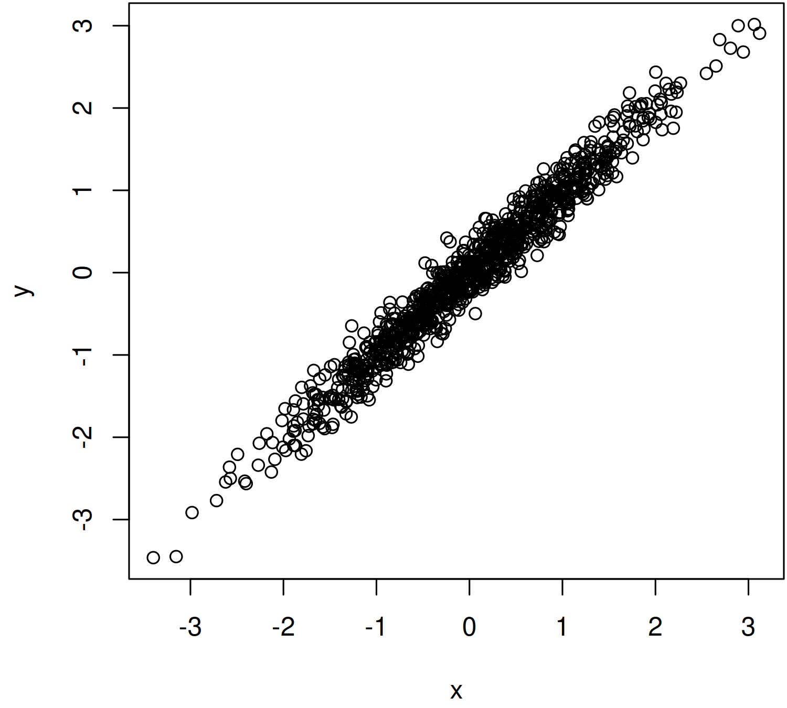

+++
author = "Blair Fix"
title =  "24. Linear regressions in R"
date = "2023-05-28"
slug = "linear-regression"
description = "I teach you how to use the R linear regression function"
tags = [ "correlation", "regression", "lm", "cor", "rnorm", "coefficients", "r-squared" ]
+++


The linear regression is the workhorse model in science. Today I'll teach you how to use it in R.

### Make some random data

To get started, let's make a linear relation between two variables, `x` and `y`.  To do that, we'll use the `rnorm` function, which generates random numbers from a normal distribution.

The code below generates 1000 random numbers from a normal distribution with a mean of 0 and standard deviation of 1. We'll call this batch of numbers `x`:


```R
x = rnorm( n = 1000, mean = 0, sd = 1 )
```

Next, let's generate some statistical noise. Like `x`, our noise will be random numbers from a normal distribution. But we'll make the standard deviation smaller than in `x`. Let's make it `sd = 0.2`:

```R
noise = rnorm( n = 1000, mean = 0, sd = 0.2 )
```

Finally, let's make a linear relation. We'll define the variable `y` as: 

```R
y = x + noise
```


### Plot your data first!

Looking ahead, we're going to fit a linear regression to our x-y data. But before we do that, it's always best to plot the data to see what it looks like. Let's do that now:

```R
plot(x, y)
```

The result looks like this --- a nice linear relation between `x` and `y`:




Warning: if you plot your data and find that the trend is *curved*, stop now. It's silly to fit a linear model to curvy data. You'll need to do something more sophisticated, which I'll discuss another time. 


### Correlation

Alright, we've got a linear relation. Before we run a regression, let's start with its simpler cousin, the correlation.

To get the correlation coefficient between two sets of data, we use the `cor` function:

```R
cor(x, y)
```

It will spit back the correlation coefficient between `x` and `y`. As expected, it's high:

```R
> cor(x, y)
[1] 0.9797063
```

For some context, the [correlation coefficient](https://en.wikipedia.org/wiki/Pearson_correlation_coefficient) is a number that varies from -1 to 1. It's often given the symbol r:

* r = 0:  no correlation
* r = 1: a perfect positive correlation
* r = -1: a perfect negative correlation

So our x-y relation has a correlation coefficient of r = 0.98 --- a strong relation.


### Linear regression

Now to our more complicated friend, the linear regression. To run a regression in R, we use the `lm` function. Here's what it looks like:

```R
lm( y ~ x )
```

Some notes. Yes, you need to put the dependent variable (here `y`) *before* the independent variable (here `x`). And if you're wondering, the `~` symbol is code for 'related to'.


Let's look at the output of this code:

```R
> lm( y ~ x )

Call:
lm(formula = y ~ x)

Coefficients:
(Intercept)            x
   0.009812     1.005313
```

Right away, you can see that it's more complicated that the output of the correlation function. Here's what it means.

First, R dumps back the formula that you gave it:

```R
Call:
lm(formula = y ~ x)
```

Next, R tells you the coefficients of the linear regression.

```R
Coefficients:
(Intercept)            x
   0.009812     1.005313
```

To make sense of these numbers, let's review some high school math. The equation for a line is often taught as:

y = mx + b

Here m is the slope and b is the y intercept. To confuse you a bit, statisticians usually flip the order of the equation like this;

y =  b + mx

Thinking like a statistician, R dumps the coefficients in this latter order. So the intercept (b) is 0.0098. And the slope (m) is 1.005. So our model is;

y = 0.0098 + 1.005 x


Now we can see what our noise did. Without it, we'd have a perfect linear relation, y = x. But the noise fudges things up, adding a non-zero intercept and making the slope differ slightly from 1.


### Accessing the full regression menu

To recap, if we put `lm( y ~ x)` into the terminal, R will dump the coefficients of the regression. But under the hood, R can give us much more detail. 

To see these details, we need to save our regression as a variable. Let's call it `model`:

```R
model = lm( y ~ x )
```

To get the gory details about our model, we can use the `summary` function:

```R
summary( model )
```

We'll get a data dump that looks like this:


```R
Call:
lm(formula = y ~ x)

Residuals:
     Min       1Q   Median       3Q      Max
-0.72652 -0.13974 -0.00039  0.13968  0.75094

Coefficients:
            Estimate Std. Error t value Pr(>|t|)
(Intercept) 0.009812   0.006531   1.502    0.133
x           1.005313   0.006511 154.412   <2e-16 ***
---
Signif. codes:  0 ‘***’ 0.001 ‘**’ 0.01 ‘*’ 0.05 ‘.’ 0.1 ‘ ’ 1

Residual standard error: 0.2065 on 998 degrees of freedom
Multiple R-squared:  0.9598,	Adjusted R-squared:  0.9598
F-statistic: 2.384e+04 on 1 and 998 DF,  p-value: < 2.2e-16
```

There's a confusing amount of information here, so let's wade through it. 

First, R gives us a summary of the regression 'residuals'. These are the distances between the y values in our data and the y values in our model.

```R
Residuals:
     Min       1Q   Median       3Q      Max
-0.72652 -0.13974 -0.00039  0.13968  0.75094
```


Next, R dumps the coefficients of the linear model. The actual estimates are in the `Estimate` column. Next to these values, we get a bunch of statistics that I won't wade through here.

```R
Coefficients:
            Estimate Std. Error t value Pr(>|t|)
(Intercept) 0.009812   0.006531   1.502    0.133
x           1.005313   0.006511 154.412   <2e-16 ***
---
Signif. codes:  0 ‘***’ 0.001 ‘**’ 0.01 ‘*’ 0.05 ‘.’ 0.1 ‘ ’ 1
```

Finally, we get a summary of the regression fit, the most important of which is the R-squared value.

```R
Multiple R-squared:  0.9598,	Adjusted R-squared:  0.9598
```


### Getting coefficients and the R-squared value

Having confused you with R's data dump, let's make things simpler.

When I run a regression, I typically want to save the regression coefficients. To get them, we first save our regression (here as `model`). Then we extract the model coefficients (the y-intercept and slope) using the `coef` function:

```R
model = lm( y ~ x )
model_coefficients = coef(model)
```

Let's have a look at them:

```R
> model_coefficients
(Intercept)           x
0.009811796 1.005312922
```

Yep, still the same as before.

Now let's extract the R-squared value. To do that, we use this code:


```R
summary(model)$r.squared
```

I get back an R-squared of about 0.96 --- nice and high:


```R
> summary(model)$r.squared
[1] 0.9598244
```

But wait, what does an R-squared value mean? Well, in simple terms the R-squared tells us the portion of variation in y that is explained by our linear model. So in this example, a linear model between y and x explains 96% of the variation in y. 


### Some homework

To get comfortable with linear regressions, here's some homework. 

First, try adjusting the standard deviation in the noise distribution. Here, for example, I've increased the noise to have `sd = 0.6`. See how that affects the regression.

```R
x = rnorm( n = 1000, mean = 0, sd = 1)
noise = rnorm( n = 1000, mean = 0, sd = 0.6 )
y = x + noise
```

You can also change the slope of the relation like this:

```R
y = 3*x + noise
```

You might also try varying the sample size. To do that, change the `n` value in the `rnorm` function. Here's a sample size of 10:


```R
x = rnorm( n = 10, mean = 0, sd = 1)
noise = rnorm( n = 10, mean = 0, sd = 0.6 )
y = x + noise
```


See what you find!
