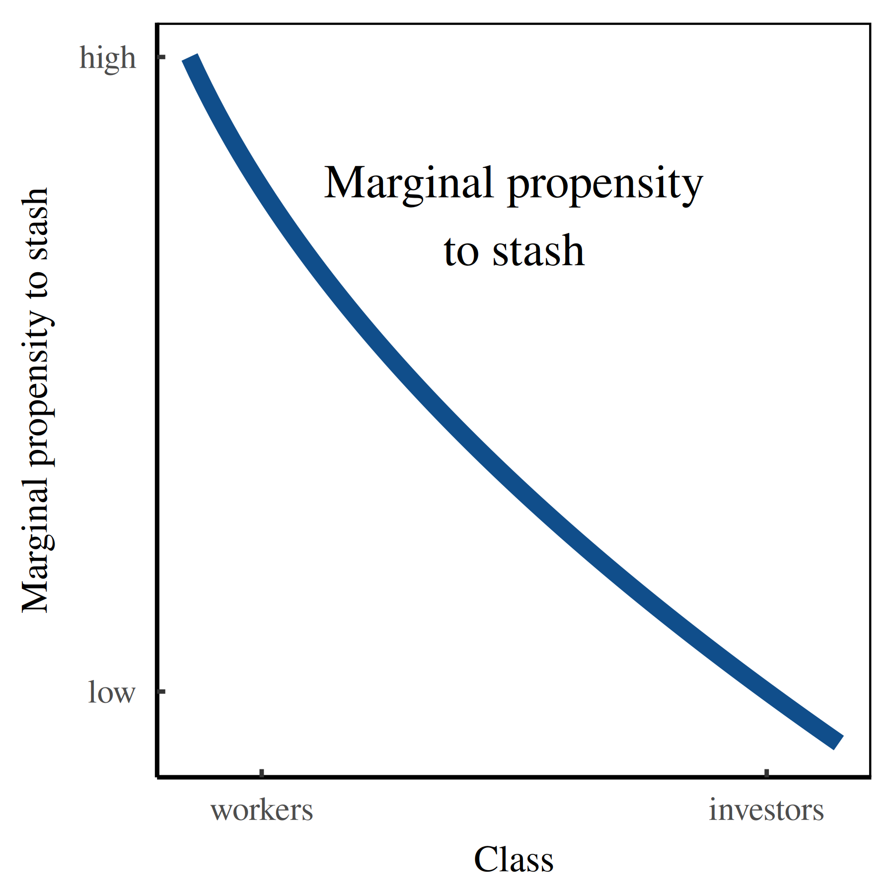

+++
author = "Blair Fix"
title =  "Marginal propensity to stash"
date = "2022-02-25"
description = "Workers tend to stash more of their savings in self-storage locations"
tags = [ "Milton Fryman", "fake theories", "shoebox theory of monetary management", "marginal propensity to stash" ]
type = "page"
+++





The marginal propensity to stash is an empirical regularity in how different classes of people store their money. It was first observed by the economist [Milton Fryman](https://sciencedesk.economicsfromthetopdown.com/satire/fryman/).

Based on years of fieldwork, Fryman determined that unlike the rich, workers tended to distrust banks. As such, workers preferred to stash their savings in self-storage locations --- proverbial 'shoeboxes'.

Given this greater marginal propensity to stash, workers' savings tended to suffer more from entropic decay. Whereas bank ledgers were abstract numbers not subject to the laws of thermodynamics, self-stored cashed tended to get lost and/or destroyed. 

Noting this entropic destruction, Fryman proposed that allocating income to workers was a key way to regulate the money supply. This thinking culminated in his [shoebox theory of monetary management](https://sciencedesk.economicsfromthetopdown.com/satire/shoebox/).
